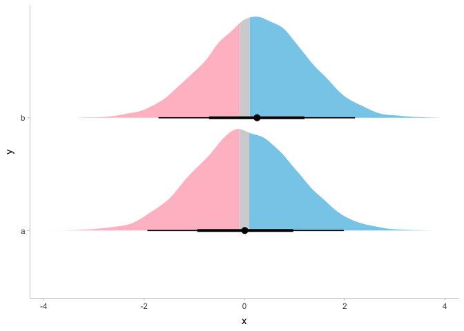

<!-- README.md is generated from README.Rmd. Please edit that file -->

# laRs

<!-- badges: start -->

<!-- badges: end -->

Convenience package for personal use

## Installation

You can install the the development version from
[GitHub](https://github.com/) with:

``` r
# install.packages("devtools")
devtools::install_github("Agasax/laRs")
```

## Example

``` r
library(laRs)
library(tidyverse)
#> ── Attaching packages ─────────────────────────────────────── tidyverse 1.3.0 ──
#> ✓ ggplot2 3.3.2     ✓ purrr   0.3.4
#> ✓ tibble  3.0.4     ✓ dplyr   1.0.2
#> ✓ tidyr   1.1.2     ✓ stringr 1.4.0
#> ✓ readr   1.3.1     ✓ forcats 0.5.0
#> ── Conflicts ────────────────────────────────────────── tidyverse_conflicts() ──
#> x dplyr::filter() masks stats::filter()
#> x dplyr::lag()    masks stats::lag()
library(tidybayes)
data(posterior)
posterior %>% 
  tidynamer() %>% #changes variable names to fit tidybayes
  spread_draws(a[gid]) %>% 
  compare_levels(a,by=gid) %>% 
  distplot(x = a, y = gid, ul = 0.1, ll = -0.1) #halfeye ditribution plot
```


