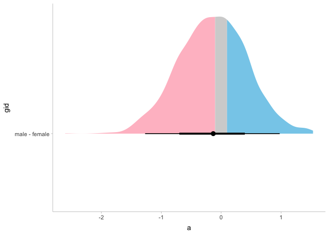

<!-- README.md is generated from README.Rmd. Please edit that file -->

# laRs

<!-- badges: start -->

<!-- badges: end -->

Convenience package for personal use

## Installation

You can install the the development version from
[GitHub](https://github.com/) with:

``` r
# install.packages("devtools")
devtools::install_github("Agasax/laRs")
```

## Tricolor plot

``` r
library(laRs)
library(tidyverse)
library(tidybayes)
data(posterior)
posterior %>% 
  tidy_cmdstanr() %>% #changes variable names to fit tidybayes
  spread_draws(a[gid]) %>% 
  compare_levels(a,by=gid) %>% 
  tricolor(x = a, y = gid, ul = 0.1, ll = -0.1) #halfeye ditribution plot
```



## Cohen’s kappa

``` r
x <- matrix(c(106, 10,4,22,28, 10,2, 12,  6),ncol=3,byrow=TRUE)
cohenkappa(x,weights="quadratic")
#> cohenkappa(x = x, weights = "quadratic")
#> 
#> Cohen's Kappa and weighted Kappa for categorical agreement 
#> 
#>            kappa kappa_max kappa_ratio
#> Unweighted  0.43      0.95        0.45
#> Weighted    0.57      0.86        0.66
#> 
#> 
#> Number of observations: 200
#> Weights: quadratic
```

## Beta test for difference of proportions

``` r
test <- beta_diff(8,11,6,11,prior="uniform",sample=1e4)
test
#> Probability of lower eventrate in a than b is: 
#> 0.2

test$post.samples %>% 
  tricolor(x=diff)
```


